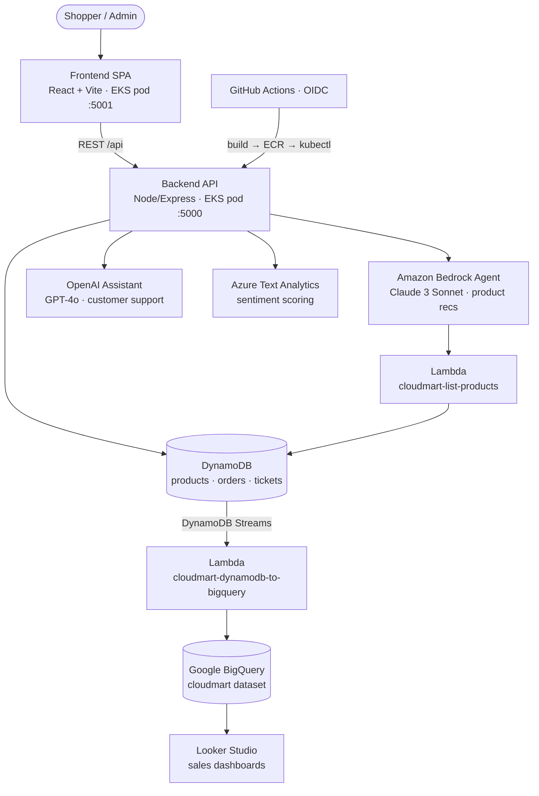
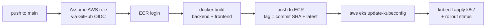

# CloudMart

CloudMart is a cloud-native, multicloud e-commerce store built as the reference application for a
**MultiCloud, DevOps & AI Challenge**. It combines a React single-page storefront, a Node/Express
backend on Kubernetes (AWS EKS), and AI features spread across three cloud providers: an Amazon
Bedrock product-recommendation agent, an OpenAI customer-support assistant, Azure sentiment
analysis of support conversations, and a Google BigQuery analytics pipeline.

This repository is a **self-contained monorepo**: frontend, backend, all infrastructure
(Terraform), CI/CD (GitHub Actions), and operational scripts. Every step that the original
bootcamp performed by clicking in a cloud console is expressed here as code — see the
[zero-console-clicks ledger](#zero-console-clicks-ledger).

For setup and deploy instructions, see [`README.md`](README.md).

---

## Business case

CloudMart is framed around an e-commerce company under margin pressure from lower-priced
competitors. The response is to re-architect the application to run in the cloud with DevOps
practices and AI assistants baked in, with two goals:

- **Cut customer-support cost** — AI assistants field the majority of routine inquiries, leaving a
  small human team to supervise and handle escalations.
- **Modernize delivery** — Infrastructure as Code, containers, managed Kubernetes, and an
  automated CI/CD pipeline replace manual operations.

Two analytics use cases sit on top of the store:

1. **Sentiment analysis** — after each support conversation, the transcript is scored
   positive / negative / neutral so the support team can gauge assistant quality.
2. **Real-time sales analytics** — every order flows into a cloud data warehouse for BI dashboards.

---

## Architecture



| Layer | Technology | Provider |
| --- | --- | --- |
| Frontend | React 18 SPA (Vite, Tailwind), served by `serve` | AWS EKS |
| Backend | Node/Express REST API | AWS EKS |
| Data store | DynamoDB — `cloudmart-products`, `cloudmart-orders`, `cloudmart-tickets` | AWS |
| Product-rec AI | Amazon Bedrock agent (Claude 3 Sonnet) + Lambda action group | AWS |
| Support AI | OpenAI Assistant (GPT-4o) with order function tools | OpenAI |
| Sentiment | Azure AI Language — Text Analytics | Azure |
| Analytics | DynamoDB Streams → Lambda → BigQuery → Looker Studio | GCP |
| Orchestration | Docker → ECR → EKS (Kubernetes) | AWS |
| CI/CD | GitHub Actions + OIDC | GitHub → AWS |
| IaC | Terraform (all resources across AWS/Azure/GCP) | all |

---

## Monorepo layout

```
cloudmart/
├── frontend/                 React + Vite + Tailwind SPA
├── backend/                  Node/Express API
│   └── src/lambda/           listProducts, addToBigQuery
├── infra/                    Terraform (root module)
│   ├── aws/                  DynamoDB, IAM, Lambda, ECR, Bedrock, EKS, VPC, OIDC
│   ├── azure/                Text Analytics (enable_azure)
│   └── gcp/                  BigQuery + service account (enable_gcp)
├── k8s/                      backend.yaml, frontend.yaml
├── scripts/                  bootstrap-openai-assistant, seed-products, build-lambdas, teardown
├── .github/workflows/        ci.yml, deploy.yml
├── Makefile
├── README.md   PROJECT.md
└── docs/
```

## Frontend

- **React 18** SPA, **react-router-dom 6**, **Vite 5**, **Tailwind 3**, **axios**, **lucide-react**.
  JavaScript/JSX; ESLint 9.
- Routes in [`frontend/src/App.jsx`](frontend/src/App.jsx): `/` (store + AI widget),
  `/customer-support`, `/about`, `/cart`, `/admin`, `/profile`, `/orders`, `/my-orders`,
  `/tickets`.
- Components under `frontend/src/components/<Name>/index.jsx`; `AIAssistant` is the floating
  Bedrock widget, `SupportPage` the threaded OpenAI chat, `AdminTicketView` shows sentiment.
- [`frontend/src/config/axiosConfig.js`](frontend/src/config/axiosConfig.js) reads
  `VITE_API_BASE_URL` (baked in at build time). Anonymous user in `localStorage` — no auth.

## Backend

Node/Express (ES modules) in [`backend/src`](backend/src), mounting `/api/products`,
`/api/orders`, `/api/ai`, `/api/tickets`. Layered controllers → services:

- **products / orders / tickets** — DynamoDB DocumentClient CRUD against the three tables.
- **ai** ([`backend/src/services/aiService.js`](backend/src/services/aiService.js)) —
  OpenAI Assistants (thread runs + `delete_order` / `cancel_order` function tools), Bedrock Agent
  Runtime (`InvokeAgentCommand`), and Azure Text Analytics `analyzeSentiment` (writing scored
  tickets to `cloudmart-tickets`).
- **Lambdas** — `listProducts` (Bedrock action-group executor; scans products) and `addToBigQuery`
  (DynamoDB stream → BigQuery insert).

Config is entirely environment-driven (`PORT`, `AWS_REGION`, `BEDROCK_AGENT_ID`,
`BEDROCK_AGENT_ALIAS_ID`, `OPENAI_API_KEY`, `OPENAI_ASSISTANT_ID`, `AZURE_ENDPOINT`,
`AZURE_API_KEY`). In EKS these come from a Terraform-managed Kubernetes Secret; AWS credentials are
supplied by IRSA.

### Backend API contract (consumed by the frontend)

| Endpoint | Method | Use |
| --- | --- | --- |
| `/api/products` | GET, POST | List / create products |
| `/api/products/:id` | PUT, DELETE | Update / delete a product |
| `/api/orders` | GET, POST | List / create orders |
| `/api/ai/start`, `/api/ai/message` | POST | OpenAI support assistant (thread-based) |
| `/api/ai/analyze-sentiment` | POST | Score a support conversation |
| `/api/ai/bedrock/start`, `/api/ai/bedrock/message` | POST | Bedrock product-rec agent |

---

## AI features

- **Product recommendations (Amazon Bedrock)** — a Bedrock agent on Claude 3 Sonnet, surfaced as
  the floating `AIAssistant` widget. It calls the `cloudmart-list-products` Lambda (an OpenAPI
  action group) for live catalog data and recommends only real products.
- **Customer support (OpenAI)** — a GPT-4o Assistant powers `/customer-support`; it can cancel or
  delete orders via function tools wired to the order service.
- **Sentiment analysis (Azure)** — when a support chat ends, the transcript goes to Azure Text
  Analytics; the positive/negative/neutral label shows per ticket in `AdminTicketView`.
- **Sales analytics (GCP)** — new orders emit DynamoDB stream events that trigger the
  `cloudmart-dynamodb-to-bigquery` Lambda, loading them into a BigQuery `cloudmart` dataset for
  Looker Studio.

---

## Infrastructure (Terraform)

`infra/` is a single root module that always provisions AWS and conditionally provisions Azure/GCP
(`enable_azure` / `enable_gcp`), so a reviewer with only AWS can still `terraform apply`.

- **`infra/aws/`** — VPC (`terraform-aws-modules/vpc`), EKS cluster + managed node group
  (`terraform-aws-modules/eks`), DynamoDB ×3 (orders with a stream), the two Lambdas
  (`archive_file`-packaged) + Bedrock invoke permission + stream event-source mapping, IAM
  (Lambda role, IRSA pod-execution role, **GitHub OIDC provider + scoped deploy role**), ECR ×2,
  and the Bedrock **agent + action group + alias** (`aws_bedrockagent_*`).
- **`infra/azure/`** — `azurerm_cognitive_account` (Text Analytics) → endpoint + key outputs.
- **`infra/gcp/`** — BigQuery dataset + table, service account + key.
- **`infra/main.tf`** — creates the backend **Kubernetes Secret straight from Terraform outputs**
  (Bedrock IDs) + tfvars (OpenAI/Azure keys), so IDs are never hand-copied into YAML, plus the
  IRSA-annotated pod service account.

---

## CI/CD pipeline (GitHub Actions + OIDC)

Two workflows in [`.github/workflows/`](.github/workflows):

- **[`ci.yml`](.github/workflows/ci.yml)** (pull requests / non-`main` pushes) — installs, lints,
  and builds the frontend, and syntax-checks the backend. A fast pre-merge gate.
- **[`deploy.yml`](.github/workflows/deploy.yml)** (push to `main`, or manual dispatch) — the
  release pipeline.

**Deploy flow:**



**OIDC trust — why there are no stored AWS keys.** Terraform creates an IAM OIDC identity provider
for `token.actions.githubusercontent.com` plus a deploy role
([`infra/aws/iam.tf`](infra/aws/iam.tf)). GitHub Actions presents a short-lived signed token;
AWS exchanges it for temporary credentials. The role's trust policy is scoped to a single
repo/branch:

```
repo:<github_owner>/<github_repo>:ref:refs/heads/<github_branch>
```

so only this repository's `main` branch can assume it. The role can push to the two ECR repos and
describe the cluster; an EKS **access entry** ([`infra/aws/eks.tf`](infra/aws/eks.tf)) grants it
`kubectl` admin so the pipeline can apply manifests.

**Required GitHub Actions variables** (Settings → Secrets and variables → Actions → Variables):

| Variable | Source |
| --- | --- |
| `AWS_DEPLOY_ROLE_ARN` | `terraform output github_actions_deploy_role_arn` |
| `AWS_REGION` | e.g. `us-east-1` |
| `EKS_CLUSTER_NAME` | `terraform output eks_cluster_name` |
| `VITE_API_BASE_URL` | backend LoadBalancer URL (set after the first deploy) |

**Image tags & rollback.** Images are tagged with the commit SHA (and `latest`); the deploy applies
the SHA-pinned image and waits on `kubectl rollout status`. Rolling back is re-running the workflow
on an older commit, or `kubectl set image` to a previous SHA.

**Frontend API URL.** The frontend bakes `VITE_API_BASE_URL` at build time (Vite), so the deploy
passes it as a Docker build-arg. On the first deploy the backend LoadBalancer doesn't exist yet;
once it does, set the `VITE_API_BASE_URL` repo variable and re-deploy so the frontend targets the
API.

## Configuration & secret flow

The backend is entirely environment-driven, and no ID is ever hand-copied:

- **Bedrock agent/alias IDs** → produced by Terraform, written directly into
  `kubernetes_secret.backend` ([`infra/main.tf`](infra/main.tf)) from module outputs.
- **OpenAI key/assistant id, Azure endpoint/key** → supplied via `terraform.tfvars` (Azure values
  come from the Azure module output when `enable_azure` is on) and folded into the same Secret.
- **AWS credentials** → never set; **IRSA** gives the pod its permissions through the
  `cloudmart-pod-execution-role` service account.

The backend Deployment consumes it all with a single `envFrom.secretRef`
([`k8s/backend.yaml`](k8s/backend.yaml)).

---

## How it was built

This repo was derived from the original manual, console-driven bootcamp challenge. Every step that
was previously a click — IAM, DynamoDB, EKS, ECR, the Bedrock agent, the OpenAI assistant, Azure,
GCP, CI/CD — is now expressed as Terraform, scripts, or GitHub Actions. The mapping is below.

## Zero-console-clicks ledger

Every manual step from the original bootcamp, and its code replacement here:

| Original manual step | Replaced by |
| --- | --- |
| Create IAM roles in console | `infra/aws/iam.tf`, `eks.tf` |
| Launch EC2 workstation, install tooling | Removed — run Terraform locally / in CI |
| S3 warm-up bucket | Dropped (unused by the app) |
| Create DynamoDB tables | `infra/aws/dynamodb.tf` |
| `eksctl create cluster` | `infra/aws/eks.tf` (+ `vpc.tf`) |
| Create ECR repos + "View push commands" | `infra/aws/ecr.tf` + `deploy.yml` |
| Build Bedrock agent / action group / alias | `infra/aws/bedrock.tf` |
| Create OpenAI assistant in dashboard | `scripts/bootstrap-openai-assistant.mjs` |
| Provision Azure Text Analytics | `infra/azure/text_analytics.tf` |
| Create GCP dataset / table / SA | `infra/gcp/main.tf` |
| Hand-edit YAML with agent/assistant IDs | `kubernetes_secret` from Terraform outputs |
| CodePipeline + GitHub OAuth handshake | GitHub Actions + OIDC (`deploy.yml`, `iam.tf`) |
| Manual teardown clicking | `scripts/teardown.sh` + `terraform destroy` |

**Residual (documented, not resource-clicking):**

- **Bedrock foundation-model access** — an account-level grant with no first-class Terraform
  resource; enable Claude 3 Sonnet once via the console/CLI.
- **Supplying secrets** — AWS credentials for Terraform, `OPENAI_API_KEY`, and (optional)
  Azure/GCP credentials via `terraform.tfvars`/OIDC. This is configuration, not resource creation.

---

## Security notes

- No secrets committed — `.gitignore` covers `*.tfvars` (except `.example`), `*.tfstate*`, `.env`,
  and `google_credentials.json`.
- The GitHub OIDC deploy role trust policy is scoped to `repo:<owner>/cloudmart:ref:refs/heads/main`.
- App pods use IRSA (no static AWS keys). IAM policies are scoped to the specific tables/functions.
  Where the original bootcamp used `AdministratorAccess` for teaching, this project narrows it.
- Terraform uses local state by default; the README notes an S3 + DynamoDB remote backend as the
  production upgrade.

---

## Reference

The original step-by-step build (Day 1–5 + Resource Cleanup) lives in the **MultiCloud, DevOps &
AI Challenge Documentation** (Notion). Diagrams and challenge assets are in `docs/architecture/`;
the design spec is in `docs/superpowers/specs/`.
