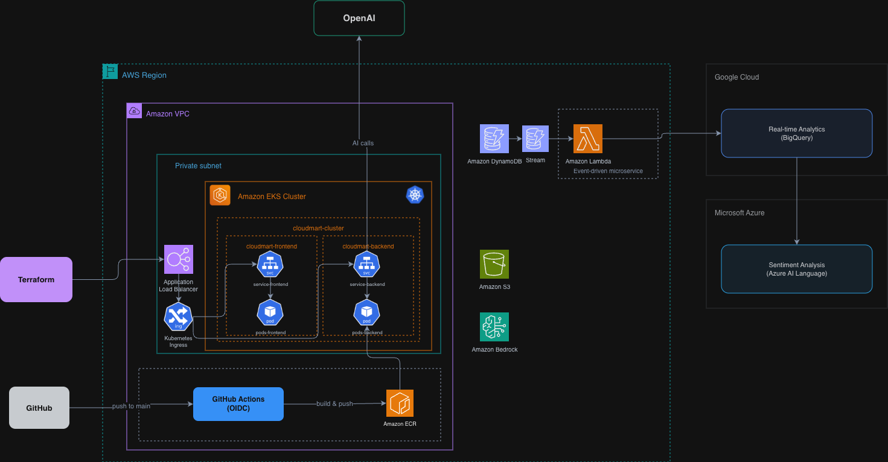

# CloudMart

A multicloud, cloud-native e-commerce store with built-in AI — deployable end-to-end from code,
**no console clicking**. React storefront + Node/Express API on **AWS EKS**, an **Amazon Bedrock**
product-recommendation agent, an **OpenAI** support assistant, **Azure** sentiment analysis, and a
**Google BigQuery** analytics pipeline. All infrastructure is Terraform; CI/CD is GitHub Actions
with OIDC.

> Originally a manual, 5-day bootcamp challenge (see [`PROJECT.md`](PROJECT.md) and
> `docs/architecture/`). This repo turns every manual step into code.

## Repository layout

```
frontend/            React + Vite + Tailwind SPA
backend/             Node/Express API (+ two Lambdas under src/lambda)
infra/               Terraform — aws (always on) + azure/gcp (toggle-able)
k8s/                 Backend + frontend Kubernetes manifests
scripts/             OpenAI bootstrap, product seed, lambda build, teardown
.github/workflows/   ci.yml (PRs) + deploy.yml (OIDC deploy to EKS)
Makefile             bootstrap / infra / seed / destroy
```

## Architecture



---

## Prerequisites

| Tool | Version | Used for |
| --- | --- | --- |
| [Terraform](https://developer.hashicorp.com/terraform/install) | ≥ 1.5 | provisioning all infra |
| [AWS CLI](https://docs.aws.amazon.com/cli/latest/userguide/getting-started-install.html) | v2 | auth + `eks get-token` (kubectl) |
| [kubectl](https://kubernetes.io/docs/tasks/tools/) | ≥ 1.28 | deploying to EKS |
| [Docker](https://docs.docker.com/get-docker/) | any recent | building images (local deploy) |
| [Node.js](https://nodejs.org/) | 18+ | frontend/backend/scripts |
| jq, bash, make | — | scripts + Makefile |

**Accounts:**
- **AWS** — always required. Configure credentials first: `aws configure` (or SSO). The identity
  you use becomes the EKS cluster admin.
- **OpenAI** — an API key with billing (the support assistant needs ~$5 credit).
- **Azure** and **GCP** — only if you set `enable_azure` / `enable_gcp`.

> **💸 Cost warning.** This stack is **not** free-tier. A running EKS cluster, its node(s), the
> NAT gateway, and two `LoadBalancer` Services bill by the hour (~a few USD/day). DynamoDB, Lambda,
> and Bedrock are pay-per-use. **Run [`make destroy`](#teardown) when you're done** to stop charges.

### One-time: enable the Bedrock model

Amazon Bedrock foundation-model access is an **account-level grant with no Terraform resource** —
the only step that isn't code. Once per account/region, enable **Claude 3 Sonnet**:

- Console: Bedrock → *Model access* → enable `Anthropic — Claude 3 Sonnet`, or
- CLI: request access via the Bedrock console (marketplace subscription) for
  `anthropic.claude-3-sonnet-20240229-v1:0` in your region (default `us-east-1`).

Do this **before** `terraform apply`, or the agent's `prepare` step fails.

---

## Deploy — step by step

### 1. Create the OpenAI assistant

```bash
export OPENAI_API_KEY=sk-...
make bootstrap          # prints OPENAI_ASSISTANT_ID
```

### 2. Configure Terraform

```bash
cp infra/terraform.tfvars.example infra/terraform.tfvars
```

Edit `infra/terraform.tfvars`:

```hcl
github_owner        = "your-github-username"   # scopes the OIDC deploy role
openai_api_key      = "sk-..."
openai_assistant_id = "asst_..."               # from step 1
# enable_azure / enable_gcp default to false
```

### 3. Stand up the infrastructure

```bash
make infra              # build-lambdas → terraform init → terraform apply
```

This creates the VPC, EKS cluster + node group, DynamoDB tables, Lambdas, ECR repos, the Bedrock
agent + alias, IAM (incl. the GitHub OIDC provider + deploy role), and the backend Kubernetes
Secret. Review the plan, type `yes`. Note the outputs — see the table below.

| Terraform output | What it's for |
| --- | --- |
| `github_actions_deploy_role_arn` | GitHub Actions variable `AWS_DEPLOY_ROLE_ARN` |
| `eks_cluster_name` | GitHub Actions variable `EKS_CLUSTER_NAME` (and `aws eks update-kubeconfig`) |
| `ecr_frontend_repository_url` / `ecr_backend_repository_url` | where images are pushed |
| `bedrock_agent_id` / `bedrock_agent_alias_id` | wired into the backend Secret automatically |

Run `make outputs` any time to reprint them.

### 4. Wire CI/CD (GitHub Actions)

In the GitHub repo: **Settings → Secrets and variables → Actions → Variables**, add:

| Variable | Value |
| --- | --- |
| `AWS_DEPLOY_ROLE_ARN` | `terraform -chdir=infra output -raw github_actions_deploy_role_arn` |
| `AWS_REGION` | `us-east-1` (or your region) |
| `EKS_CLUSTER_NAME` | `terraform -chdir=infra output -raw eks_cluster_name` |
| `VITE_API_BASE_URL` | leave unset for the first deploy (see below) |

No AWS keys are stored — the deploy role is assumed via OIDC.

### 5. Deploy

Push to `main` (or run the **Deploy** workflow manually). `deploy.yml` assumes the role, builds
both images, pushes to ECR, and `kubectl apply`s `k8s/` to EKS.

Get the URLs once the LoadBalancers are provisioned:

```bash
aws eks update-kubeconfig \
  --name "$(terraform -chdir=infra output -raw eks_cluster_name)" --region us-east-1
kubectl get service
```

- Storefront: `cloudmart-frontend-app-service` (port 5001) — admin catalog at `/admin`.
- Backend API: `cloudmart-backend-app-service` (port 5000).

### 6. Point the frontend at the backend (first deploy only)

The frontend bakes `VITE_API_BASE_URL` **at build time**, but the backend LoadBalancer URL doesn't
exist until the first deploy. So:

1. First deploy runs with the default (`/api`).
2. Grab the backend LB host: `kubectl get service cloudmart-backend-app-service`.
3. Set the `VITE_API_BASE_URL` Actions variable to `http://<backend-lb-host>:5000/api`.
4. Re-run the Deploy workflow — the frontend is rebuilt pointing at the API.

### 7. Seed sample data (optional)

```bash
export AWS_REGION=us-east-1
make seed               # inserts sample products into DynamoDB
```

---

## Enabling Azure / GCP

Both are off by default. To turn them on, edit `infra/terraform.tfvars`:

```hcl
# Azure sentiment analysis
enable_azure          = true
azure_location        = "eastus"
azure_subscription_id = "..."           # az login first

# GCP BigQuery analytics
enable_gcp     = true
gcp_project_id = "your-gcp-project-id"  # gcloud auth application-default login first
```

Then:

```bash
make infra                 # provisions Azure/GCP + the BigQuery Lambda + stream mapping
make gcp-credentials       # writes the SA key the addToBigQuery Lambda needs
make infra                 # re-apply so the Lambda repackages with the credentials
```

When `enable_azure` is on, the Azure endpoint + key flow automatically into the backend Secret.

---

## Local development

```bash
# backend  (http://localhost:5000)
cd backend && cp .env.example .env && npm install && npm run dev

# frontend (Vite dev server; proxied to the backend)
cd frontend && cp .env.example .env && npm install && npm run dev
```

Fill `backend/.env` with your OpenAI key + Bedrock/Azure ids for full AI functionality; the store
itself works against DynamoDB with AWS credentials in your environment.

---

## Things to know

- **Terraform state is local by default** (`infra/terraform.tfstate`, gitignored). For real/shared
  use, add an S3 + DynamoDB backend (`terraform { backend "s3" { ... } }`) before the first apply.
- **No static AWS keys anywhere.** Pods get AWS access via **IRSA** (the
  `cloudmart-pod-execution-role` service account is annotated with an IAM role). CI gets access via
  **GitHub OIDC**. Nothing long-lived is stored.
- **Image tags = commit SHA.** Each deploy tags images with `${{ github.sha }}` (and `latest`). To
  roll back, re-run the Deploy workflow on an older commit, or
  `kubectl set image deploy/cloudmart-backend-app cloudmart-backend-app=<ecr>/cloudmart-backend:<sha>`.
- **Secrets handling.** `.gitignore` excludes `*.tfvars` (except `.example`), `*.tfstate*`, `.env`,
  and `google_credentials.json`. The backend Kubernetes Secret is built by Terraform from outputs +
  tfvars — you never paste IDs into YAML.
- **Region.** Everything defaults to `us-east-1`. If you change `aws_region`, enable Bedrock model
  access in that region too.
- **Cost control.** Use `single_nat_gateway` (already set), keep `eks_desired_size = 1`, and
  destroy when idle. EKS + NAT + LBs are the main spend.

## Troubleshooting

| Symptom | Cause / fix |
| --- | --- |
| `AccessDeniedException` preparing the Bedrock agent | Claude 3 Sonnet model access not granted in the region — enable it (see [above](#one-time-enable-the-bedrock-model)). |
| GitHub Actions `Not authorized to perform sts:AssumeRoleWithWebIdentity` | `github_owner`/repo/branch in tfvars must match the real repo; the OIDC `sub` is scoped to `repo:<owner>/<repo>:ref:refs/heads/main`. |
| `kubectl` from CI: `error: You must be logged in` | The deploy role needs the EKS access entry (created in `infra/aws/eks.tf`); ensure `make infra` applied after adding it. |
| LoadBalancer stuck in `<pending>` | Subnets need the ELB tags (set in `infra/aws/vpc.tf`); wait a few minutes for AWS to provision the ELB. |
| Frontend calls the wrong API / CORS errors | `VITE_API_BASE_URL` wasn't set to the backend LB before the frontend image was built — set it and re-deploy (step 6). |
| `addToBigQuery` Lambda import/credential errors | Run `make gcp-credentials` then `make infra`; the zip must contain `node_modules` + `google_credentials.json`. |
| `terraform apply` hangs on EKS | Cluster creation takes ~10–15 min; node group a few more. This is normal. |

## Make targets

| Target | Does |
| --- | --- |
| `make bootstrap` | Create the OpenAI assistant, print its id |
| `make build-lambdas` | Install Lambda deps so Terraform can package them |
| `make infra` | Build lambdas, then `terraform init && apply` |
| `make plan` | `terraform plan` |
| `make gcp-credentials` | Write the BigQuery SA key to `google_credentials.json` |
| `make seed` | Seed sample products into DynamoDB |
| `make outputs` | Print Terraform outputs |
| `make destroy` | `kubectl delete` + `terraform destroy` (all clouds) |

## Teardown

```bash
make destroy
```

Removes the Kubernetes workloads then every Terraform-managed resource (EKS, Lambdas, DynamoDB,
Bedrock, ECR, IAM, VPC, and Azure/GCP if enabled). Afterward, double-check the AWS/Azure/GCP
consoles for any lingering LoadBalancers or Elastic IPs to avoid surprise charges.

## Documentation

- [`PROJECT.md`](PROJECT.md) — full architecture, AI features, CI/CD internals, and the
  zero-console-clicks ledger
- [`infra/README.md`](infra/README.md) — Terraform module notes
- [`docs/superpowers/specs/`](docs/superpowers/specs/) — design spec
- `docs/architecture/` — diagrams and the original challenge assets
